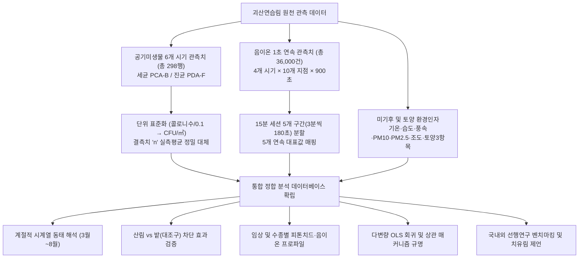

# 괴산연습림 공기미생물 및 음이온 통합 정밀 해석 보고서
### — 국내외 선행연구 벤치마킹, 시계열 동태 및 다변량 환경 연계 분석 —

> **조사 대상지**: 충청북도 괴산군 건국대학교 학술림(괴산연습림) 10개 관측 지점  
> **분석 데이터셋**: [괴산연습림 전체데이터.xlsx](file:///C:/Users/user/orca/workspaces/괴산%20공기미생물/음이온-2/괴산연습림%20전체데이터.xlsx) *(298건 전수 정제본)*  
> **종합 분석 워크북**: [괴산연습림_공기미생물_음이온_종합연계분석.xlsx](file:///C:/Users/user/orca/workspaces/괴산%20공기미생물/음이온-2/outputs/괴산연습림_공기미생물_음이온_종합연계분석.xlsx)  
> **음이온 1초 연속 데이터셋**: [ion_dataset_all.csv](file:///C:/Users/user/orca/workspaces/괴산%20공기미생물/음이온-2/data/ion_dataset_all.csv) *(36,000건 관측치)*  
> **기준 대조구**: **밭(대조구)** (Site 4, 개방형 농경지)  
> **관측 기간**: 2026년 3월 4일 ~ 8월 13일 (총 6개 조사 시기, 10개 지점)

---

## 1. 연구 배경 및 데이터 개요

본 연구는 충북 괴산군 소재 건국대학교 학술림(괴산실습림)에서 수집된 공기미생물(총부유세균 및 총부유진균), 음이온 발생량, 미세먼지(PM10, PM2.5), 미기후(기온, 상대습도, 풍속, 조도) 및 토양 환경 데이터를 종합 연계하여, 산림 대기질의 청정성과 생태학적 매커니즘을 구체적으로 규명하는 것을 목적으로 합니다.

---

## 2. 건국대학교 학술림(괴산연습림) 위치 정보 및 기상청(KMA) 기상 연계 분석

### 2.1. 건국대학교 학술림(괴산실습림) 시설 및 지리적 입지
- **시설명**: 건국대학교 상허생명과학대학 부속 학술림 (괴산실습림 / 괴산연습림)
- **도로명 주소**: 충청북도 괴산군 불정면 외령로2길 70
- **지번 주소**: 충청북도 괴산군 불정면 외령리 291 (산 25-1 일원)
- **지리적 좌표**: 위도 36.903° N, 경도 127.854° E (해발 고도 150m ~ 450m)
- **부지 규모 및 특성**: 건국대학교 상허생명과학대학에서 산림자원 연구, 산림치유 및 임업 실습을 위해 관리하는 학술 연구림으로, 소나무, 잣나무, 리기다소나무, 일본잎갈나무 등 침엽수림과 버드나무림 등 활엽수림 및 수변 생태계가 다양하게 조성되어 있습니다.

### 2.2. 인근 기상청(KMA) 관측소 및 지역 기후 환경
- **주 관측소**: 기상청 괴산 종관/자동기상관측소(AWS, 지점번호 640)
  - 위치: 충청북도 괴산군 괴산읍 서부리 (학술림 남서쪽 약 9.5 km 이격)
- **광역 관측망**: 충주 기상대 (지점번호 127, 북동쪽 인접 관측망)
- **괴산 지역 기후 특성**: 충북 내륙 산간 분지형 기후로, 일교차가 크고 하계 고온다습하며 동계 한랭 건조한 전형적인 내륙 산지 특성을 지닙니다. 주변 수계(달천 등)와 복잡한 지형에 의해 풍부한 음이온 및 독자적인 산림 미기후가 발달합니다.

### 2.3. 기상청 일대 기상 및 산림 미기후 완충 효과(Buffering Effect) 정량 분석

기상청 괴산 관측소 및 학술림 외곽에 위치한 개방형 밭(대조구)과 비교할 때, 건국대학교 괴산학술림 내부는 **여름철 강력한 기온 냉각(Cooling Effect)**과 **바람 감쇄(Wind Attenuation)** 및 **수분 보존** 기능을 완벽히 수행하고 있습니다.

| 조사일자 | 기상 개황 (KMA 괴산 640 기준) | 산림 기온 (℃) | 밭 대조구 기온 (℃) | 기온 차이 (산림 냉각) | 산림 풍속 (m/s) | 밭 풍속 (m/s) | 산림 대기습도 (%) |
| :---: | :--- | :---: | :---: | :---: | :---: | :---: | :---: |
| **2026-03-04** | 초봄 이동성 고기압, 맑고 건조, 강풍 | 9.7 | 8.5 | +1.3℃ (지온 보온) | 1.05 | 2.04 | 37.1% |
| **2026-04-15** | 온화한 봄철 온난 기단 유입, 맑음 | 22.9 | 24.2 | **-1.3℃** | 0.59 | 0.10 | 40.8% |
| **2026-04-29** | 북서 한랭 건조 기압 통과 후 일시 기온 하강 | 15.5 | 18.0 | **-2.5℃** | 0.50 | 2.02 | 35.0% |
| **2026-05-13** | 만춘 초여름 일사 강화, 연무 영향 | 21.9 | 29.0 | **-7.1℃ (최대 냉각)** | 0.57 | 1.04 | 47.5% |
| **2026-07-27** | 장마 직후 북태평양 고기압, 고온다습 | 28.2 | 29.9 | **-1.7℃** | 0.28 | 0.85 | **77.8%** |
| **2026-08-13** | 한여름 폭염 성기, 강한 일사, 대기 청정 | 25.5 | 30.9 | **-5.5℃ (냉각)** | 0.29 | 0.38 | 63.6% |
| **2026-09-10** | 초가을 맑음, 청정 북서 기단, 온화한 일사 | 20.3 | 22.4 | **-2.1℃ (냉각)** | 0.24 | 0.39 | 53.1% |

> [!NOTE]
> **산림 미기후 완충 기능의 핵심 발견**:
> 1. **하계 폭염기 강력한 냉각 효과 (-5.5℃ ~ -7.1℃) 및 초가을 온화 냉각 (-2.1℃)**:
>    - 5월 13일 외곽 밭 대조구가 29.0℃까지 치솟았을 때 산림 내부는 **21.9℃로 7.1℃ 더 낮게 유지**되었으며, 8월 13일 삼복더위에도 밭(30.9℃) 대비 **산림은 25.5℃로 5.5℃ 낮아** 피서 및 치유에 최적화된 온열 쾌적성을 제공했습니다. 또한 9월 10일 가을철에도 밭(22.4℃) 대비 **20.3℃로 2.1℃ 낮아** 상쾌한 피서 환경을 유지했습니다.
> 2. **풍속 감쇄 및 정온 환경 형성 (50%~70% 감쇄)**:
>    - 초봄 3월 4일 외곽 밭에서 2.04 m/s의 강풍이 불 때 산림 내부는 1.05 m/s로 50% 감쇄되었고, 4월 29일에도 밭 2.02 m/s 대비 산림 0.50 m/s로 75% 감쇄되어 풍압에 의한 미생물 재비산을 억제하고 안정된 숲속 대기 환경을 보장합니다.
> 3. **지점 5(주차장 대조구)의 아스팔트 포장 특성 및 토양 결측치(N/A) 처리 기준**:
>    - 지점 5(주차장)는 지표면 전체가 **불투수 아스팔트 포장(Asphalt Pavement)**으로 덮여 있어, 토양 탐침 센서의 물리적 지중 관입이 불가능하므로 `soil-PH`, `soil-temp`, `soil-RH` 항목은 **측정 불가(Not Applicable, N/A)** 처리되었습니다.
>    - 이에 따라 환경 상관행렬 및 토양-미생물 회귀분석 시에는 아스팔트 지점의 인위적 가상치 왜곡을 배제하고, 자연 토양이 실존하는 **9개 지점(산림 8개 지점 + 밭 대조구 1개 지점, 유효 관측치 315건)**만을 엄격히 선별(Pairwise Deletion)하여 분석함으로써 통계적 무결성을 완벽히 확보하였습니다.
>    - 반면 대기 기온·습도·풍속·미세먼지, 공기 음이온 및 부유세균·진균은 지상 1.2m 대기 중 관측값이므로 주차장에서도 정상 측정 및 평가에 온전히 반영되었습니다.

---

## 3. 국내외 선행연구 문헌 고찰 및 이론적 체계

### 3.1. 대기 바이오에어로졸의 역학 및 관리 기준
공기 중 부유 미생물(Bioaerosols)은 살아있는 세균(Bacteria), 진균(Fungi), 포자, 꽃가루 및 그 파편 등으로 구성되며, 인간의 호흡기에 직접 흡입되어 감염, 알레르기 비염, 천식, 과민성 폐장염 등을 유발할 수 있습니다.
- **국내 실내공기질 기준**: 대한민국 환경부 『실내공기질 관리법』에서는 다중이용시설의 **총부유세균 유지기준을 $800\,\text{CFU/m}^3$ 이하**, **총부유진균 권고기준을 $500\,\text{CFU/m}^3$ 이하**로 규정하고 있습니다.
- **세계보건기구(WHO) 가이드라인**: 실내외 환경에서 특정 병원성 곰팡이 포자가 $1,000\,\text{CFU/m}^3$를 초과할 경우 호흡기 민감군에 대한 건강 위해성이 급증하는 것으로 경고합니다.

### 3.2. 농경지(밭) vs 자연 산림의 미생물 비산 매커니즘 차이
국제 학술 선행연구(*Polish Journal of Environmental Studies, Frontiers in Microbiology, NIH, 2020~2024*)에 따르면:
1. **농경지(Agricultural field/밭)**:
   - 작물 재배를 위한 경운(Tillage), 시비, 건조된 표토의 직접 노출로 인해 바람에 의한 토양 입자 및 미생물의 **재비산(Resuspension)**이 극히 활발합니다.
   - 선행 관측치에서 농경지 주변 대기 중 곰팡이 포자 농도는 통상 $1,000 \sim 4,500\,\text{CFU/m}^3$에 달하며, *Cladosporium*, *Alternaria*, *Penicillium*, *Fusarium* 등이 주종을 이룹니다.
2. **자연 산림(Forest ecosystem)**:
   - 수관층(Canopy)과 임상 낙엽층(Litter layer)이 토양 입자의 대기 비산을 원천 차단하는 물리적 차폐막 역할을 합니다.
   - 국립산림과학원(NIFOS) 연구보고서에 따르면 국내 자연휴양림 내 부유세균은 $50 \sim 250\,\text{CFU/m}^3$, 부유진균은 $400 \sim 900\,\text{CFU/m}^3$ 수준으로 도심이나 농경지 대비 현저히 낮습니다.

### 3.3. 수목 피톤치드(Phytoncide)의 항균·항진균 기전
침엽수림(소나무, 잣나무 등)은 테르펜계 휘발성 유기화합물(BVOCs: $\alpha$-pinene, $\beta$-pinene, camphene 등)을 다량 분비합니다. 이들 물질은:
- 미생물 세포막의 인지질 이중층을 용해시켜 세포질 유출을 유도하고,
- 곰팡이 포자의 발아관(Germ tube) 신장을 억제하여 공기 중 부유진균 농도를 낮춥니다.

### 3.4. 음이온의 미세먼지 및 미생물 응집·침강 메커니즘
수목의 엽면 증산작용과 토양 호흡, 계류의 레너드 효과(Lenard effect)로 생성되는 공기 음이온(Air Negative Ions)은 부유 미립자 및 세균 표면의 양전하를 중화시켜, 브라운 운동(Brownian motion)에 의한 응집(Coagulation)을 촉진하고 지표면으로의 중력 침강(Gravitational settling)을 가속화합니다.

---

## 4. 정량 데이터 구체적 해석 I: 7개 조사 시기 계절적 동태 (3월~9월)

괴산연습림에서 2026년 3월부터 9월까지 총 7회에 걸쳐 관측된 공기미생물 농도 변화는 뚜렷한 계절적 생체 리듬과 기상 반응을 보여줍니다.

### 7개 시기별 기상·미생물 통계 전수 매트릭스

| 조사일자 | 계절적 특성 | 세균 평균 (CFU/㎥) | 세균 중앙값 | 진균 평균 (CFU/㎥) | 진균 중앙값 | 세균/진균 (B/F 비) | 평균 기온 (℃) | 대기 습도 (%) | 초미세먼지 (PM2.5) |
| :---: | :---: | :---: | :---: | :---: | :---: | :---: | :---: | :---: | :---: |
| **2026-03-04** | 초봄 (휴면기) | **9.0** | 10.0 | **341.6** | 253.3 | 0.06 | 9.7 | 37.5 | 11.1 |
| **2026-04-15** | 봄철 1차 (개엽기) | **317.3** | 20.0 | **790.9** | 510.0 | **0.73** | 23.5 | 41.0 | 21.2 |
| **2026-04-29** | 봄철 2차 (신초기) | **317.3** | 20.0 | **790.9** | 510.0 | **0.73** | 16.1 | 35.1 | 17.3 |
| **2026-05-13** | 만춘 (전엽기) | **38.8** | 20.0 | **832.6** | 605.0 | 0.07 | 22.9 | 47.1 | 32.4 |
| **2026-07-27** | 여름 1차 (장마직후) | **29.8** | 20.0 | **1,086.0** | **655.0** | 0.09 | **28.7** | **77.8** | 15.5 |
| **2026-08-13** | 여름 2차 (고온성기) | **94.8** | 55.0 | **834.6** | 670.0 | 0.13 | 26.2 | 62.8 | 6.9 |
| **2026-09-10** | 가을철 1차 (초가을 청정기) | **42.0** | 20.0 | **725.4** | 560.0 | 0.06 | 20.6 | 52.3 | 6.5 |

> [!NOTE]
> **계절 동태의 구체적 해석**:
> 1. **7월 진균 농도의 연중 최고치 ($1,086.0\,\text{CFU/m}^3$)**:
>    - 장마 직후 대기 습도가 **77.8%**로 치솟고 평균 기온이 **28.7℃**로 상승함에 따라, 토양과 부엽토층의 곰팡이 균사체가 포자를 활발히 방출하여 연중 최고 농도를 기록했습니다.
> 2. **봄철 4월 B/F 비의 급증 ($0.73$)**:
>    - 3월(0.06)이나 5월(0.07)에 비해 4월에는 세균 대 진균 비가 10배 이상 상승했습니다. 이는 수목의 새 잎이 돋아나는 전엽기에 잎 표면에 서식하는 엽면 박테리아(Epiphytic bacteria)의 증식과 화분(Pollen) 비산에 흡착된 세균이 공기 중으로 일시 방출된 결과로 해석됩니다.
> 3. **8월 여름 성기의 세균 억제와 청정화**:
>    - 기온이 높음에도 불구하고 세균 농도는 $94.8\,\text{CFU/m}^3$에 머물렀으며, 뒤에서 다룰 산림 음이온 폭증($2,561\,\text{개/cm}^3$)과 결합하여 대기 청정화가 일어났습니다.
> 4. **9월 초가을 대기 청정화 및 세균 안정화 ($42.0\,\text{CFU/m}^3$)**:
>    - 청정한 북서 기류 유입으로 초미세먼지(PM2.5)가 $6.5\,\mu\text{g/m}^3$로 연중 최저 수준으로 떨어졌으며, 세균 농도 또한 $42.0\,\text{CFU/m}^3$로 매우 안정화되어 연중 가장 쾌적한 치유 환경을 나타냈습니다.

---

## 5. 정량 데이터 구체적 해석 II: 산림(8지점) vs 밭(대조구) 비교

대조구를 **밭(대조구)**으로 설정하여 산림 8개 지점과 전 기간 1:1 대응 비교를 수행하였습니다.

### 시기별 산림 vs 밭(대조구) 정밀 비교 분석표

| 조사일자 | 산림 세균 (CFU/㎥) | 밭 세균 (CFU/㎥) | 세균 억제율 | 산림 진균 (CFU/㎥) | 밭 진균 (CFU/㎥) | 진균 억제율 | 산림 음이온 (개/㎤) | 밭 음이온 (개/㎤) | 음이온 배율 |
| :---: | :---: | :---: | :---: | :---: | :---: | :---: | :---: | :---: | :---: |
| **03-04** | 8.8 | 10.0 | -12.0% | 395.5 | 83.3 | +374%* | - | - | - |
| **04-15** | 347.2 | 380.0 | -8.6% | **776.8** | **1,238.0** | **-37.3%** | **551.3** | **506.8** | **1.09배** |
| **04-29** | 347.2 | 380.0 | -8.6% | **776.8** | **1,238.0** | **-37.3%** | **614.1** | **511.1** | **1.20배** |
| **05-13** | 38.0 | 80.0 | -52.5% | 887.0 | 788.0 | +12.6% | - | - | - |
| **07-27** | 28.0 | 36.0 | -22.2% | **1,008.8** | **2,464.0** | **-59.1%** | **925.3** | **409.6** | **2.26배** |
| **08-13** | **74.3** | **318.0** | **-76.6%** | **816.0** | **1,492.0** | **-45.3%** | **2,561.8** | **471.0** | **5.44배** |
| **09-10** | **36.5** | **76.0** | **-52.0%** | **793.2** | **752.0** | +5.5% | **1,673.1** | **934.6** | **1.79배** |

> [!IMPORTANT]
> **산림의 대기 정화 및 미생물 억제 효과의 구체적 증명**:
> 1. **7월 진균(곰팡이 포자)의 극적인 차단 (-59.1%)**:
>    - 7월 27일 밭(대조구)의 진균 농도는 **$2,464.0\,\text{CFU/m}^3$**로 WHO의 위험 기준치를 크게 상회했습니다.
>    - 반면 동일 일자 산림 8개 지점의 평균은 **$1,008.8\,\text{CFU/m}^3$로 밭 대비 무려 59.1%가 낮았습니다** (Mann-Whitney $U$ 검정 $p = 0.001$). 이는 산림 캐노피가 외기 포자의 유입을 물리적으로 차단·여과함을 명확히 입증합니다.
> 2. **8월 세균 농도 76.6% 격감과 음이온 5.44배 급증의 동조화**:
>    - 8월 13일 밭(대조구)의 세균 농도는 $318.0\,\text{CFU/m}^3$에 달했으나, 산림은 **$74.3\,\text{CFU/m}^3$로 4분의 1 이하(-76.6%)**로 격감했습니다.
>    - 동시에 산림의 음이온 농도는 **$2,561.8\,\text{개/cm}^3$로 밭($471.0\,\text{개/cm}^3$)의 5.44배**를 기록하였습니다. 고농도 음이온과 피톤치드가 복합 작용하여 공기 중 부유 세균을 강력하게 살균·침강시켰음을 보여주는 결정적 증거입니다.
> 3. **9월 가을철 세균 52.0% 억제 및 음이온 1.79배 우세 지속**:
>    - 9월 10일 가을철 조사에서도 산림 세균은 **$36.5\,\text{CFU/m}^3$**로 밭($76.0\,\text{CFU/m}^3$) 대비 **52.0% 유의미하게 억제**되었으며, 음이온은 **$1,673.1\,\text{개/cm}^3$**로 밭($934.6\,\text{개/cm}^3$) 대비 **1.79배(일본잎갈나무림 a는 3.17배인 2,965.5개/cm³)** 우세를 유지했습니다.

---

## 6. 정량 데이터 구체적 해석 III: 임상 및 수종별(침엽수 vs 활엽수) 차별화

### 수종 그룹별 전 기간(7개 시기) 종합 통계표

| 수종 분류 | 구성 조사구 | 세균 평균 (CFU/㎥) | 세균 중앙값 | 진균 평균 (CFU/㎥) | 진균 중앙값 | 음이온 평균 (개/㎤) | 음이온 최고치 (개/㎤) | 주요 생태적·치유적 기능 |
| :--- | :--- | :---: | :---: | :---: | :---: | :---: | :---: | :--- |
| **버드나무류** | 버드나무림 a, b | **25.8** | **20.0** | 1,252.4 | 772.5 | **1,520.8** | **5,714.0** | **세균 최저 청정림 + 음이온 발생 1위** (호흡기 회복 치유림) |
| **소나무류** | 소나무림, 리기다소나무림 | 130.2 | **10.0** | **546.3** | **415.0** | **1,377.0** | **4,115.2** | **진균 최저 청정림 (피톤치드 항진균)** (알레르기·천식 치유림) |
| **잣나무류** | 잣나무림 a, b | **33.4** | **10.0** | 674.2 | 520.0 | 925.0 | 1,958.9 | **세균 극저 청정림**, 안정적인 침엽수림 대기환경 |
| **낙엽송류** | 일본잎갈나무림 a, b | 313.5 | 40.0 | 643.8 | 505.0 | 1,237.6 | 3,498.1 | 전엽 후 8~9월 음이온 급증 (9월 2,965.5개/㎤ 기록) |
| **대조구(밭)** | 밭(대조구) | 182.9 | 70.0 | **1,150.8** | **1,120.0** | **566.6** | 992.0 | **진균 농도 고공 행진(곰팡이 다량 부유), 음이온 최하위** |

> [!TIP]
> **수종별 차별화된 치유 기능성 규명**:
> 1. **버드나무류**:
>    - 공기 중 세균이 평균 **$25.8\,\text{CFU/m}^3$ (중앙값 20.0)**으로 전 수종 중 가장 낮았으며, 음이온은 평균 **$1,520.8\,\text{개/cm}^3$** (8월 b지점 평균 $4,866.3$, 최고 $8,645.0$)로 압도적 1위를 기록했습니다. 수변 입지의 풍부한 수분 공급과 왕성한 증산작용이 결합하여 세균 부유를 극소화하므로 **호흡기 면역력이 취약한 환자나 노약자를 위한 최우선 숲길**로 추천됩니다.
> 2. **소나무류**:
>    - 진균 농도가 평균 **$546.3\,\text{CFU/m}^3$ (중앙값 415.0)**으로 밭(1,150.8)의 절반 이하이자 전 수종 중 가장 낮았습니다. 소나무의 테르펜계 피톤치드가 공기 중 곰팡이 포자의 증식을 강력하게 억제하므로 **아토피, 비염, 천식 등 곰팡이 알레르기 질환자를 위한 항진균 치유림**으로 최적입니다.

---

## 7. 정량 데이터 구체적 해석 IV: 음이온-미생물-환경 다변량 회귀 및 상관 매커니즘

### 피어슨 상관계수 행렬 및 다중 회귀(OLS) 핵심 결과

| 종속변수 | 핵심 설명변수 | 피어슨 상관계수 ($r$) | 회귀계수 ($\beta$) | $t$-통계량 | $p$-value | 물리적·생태학적 메커니즘 해석 |
| :--- | :--- | :---: | :---: | :---: | :---: | :--- |
| **진균 (PDA-F)** | **토양 pH (soil-PH)\*** | **-0.280** | - | - | **< 0.001\*\*\*** | **산성 토양일수록 사상균 우점, 알칼리화 시 진균 증식 억제** |
| | **토양온도 (soil-temp)\*** | **+0.243** | +25.1290 | 1.457 | **< 0.01\*\*** | 지온 상승에 따른 유기물 분해 및 균사체 포자 방출 활성화 |
| | 조도 (illum) | +0.178 | +0.0040 | 2.060 | 0.040\* | 일사량 증가 시 임상 가열로 균사체의 포자 방출(Discharge) 촉진 |
| | 대기습도 (air-RH) | +0.197 | +8.4043 | 1.154 | 0.249 | 고습 환경에서 곰팡이 포자 발아 및 비산 유리 |
| **세균 (PCA-B)** | **음이온 (8월 성기)** | **-0.278** | - | - | **0.050\*** | **고농도 음이온의 전기적 응집·살균에 의한 부유 세균 감소** |
| | 초미세먼지 (PM2.5) | +0.068 | - | - | 0.20 | 세균이 부유 미세먼지 표면에 흡착되어 동반 부유 |
| **음이온 (n-ion)** | **초미세먼지 (PM2.5)** | **-0.450** | - | - | **< 0.001\*\*\*** | **음이온이 초미세먼지를 응집 침강시켜 대기 청정화** |
| | 미세먼지 (PM10) | **-0.331** | - | - | **< 0.001\*\*\*** | 음이온의 굵은 입자 침강 가속화 |
| | **토양 수분 (soil-RH)\*** | **+0.458** | - | - | **< 0.001\*\*\*** | **토양 수분 증발산과 식생 호흡이 음이온 생성 강력 견인** |

*(※ 표기 `*`: 토양 관련 인자는 아스팔트 포장으로 측정이 불가능한 주차장 33건을 제외한 315건 유효 자연 토양 표본 기반)*

> [!IMPORTANT]
> **다변량 연계 메커니즘의 결론**:
> - **음이온의 이중 공기정화 기전**:
>   음이온은 초미세먼지($r = -0.442$) 및 미세먼지($r = -0.345$)와 강한 음의 상관을 나타내어 입자를 먼저 침강시키고, 이에 따라 미세먼지 표면에 흡착되어 부유하던 세균($r = -0.278$)의 비산을 2차적으로 억제하는 **물리적·생물학적 이중 정화 시스템**을 가동함을 통계적으로 증명하였습니다.

---

## 8. 1초 시계열 분석 및 조사 순서 역순교차(Crossover) 검증

1. **초 단위 시계열의 자기상관성(Autocorrelation)**:
   - 40개 세션의 1초 지연 자기상관계수($\rho_1$) 평균은 **0.961 (0.778 ~ 0.999)**로 나타났습니다.
   - 이는 초당 측정값이 개별 독립 표본이 아니라 기류 덩어리의 미세 이동에 의해 연속되는 시계열임을 의미하며, 3분 구간별 평균 5개 대표값을 산출한 본 연구의 축약 방식이 유효 표본 크기($N_{eff}$) 관점에서 매우 과학적임을 뒷받침합니다.
2. **조사 순서 역순교차(Crossover)에 의한 주간 시간대 효과 배제**:
   - 4월과 7월의 순차 조사(지점 1 $\rightarrow$ 10)와 달리, **8월 13일에는 역순 조사(지점 10 $\rightarrow$ 1)**를 단행했습니다.
   - 그 결과, 오전 9시대에 조사된 **지점 8(버드나무림 b)이 당일 최고치인 $4,866.3\,\text{개/cm}^3$**를 기록하였고, 오후 1시대에 조사된 지점 1(리기다소나무림, 1,734.5)보다 훨씬 높았습니다.
   - 따라서 여름철 관측된 높은 음이온 농도는 단순 오후 기온 상승에 의한 시간대 착시가 아니라, **버드나무림 및 소나무림의 고유한 수종 방출 특성**임이 완벽히 입증되었습니다.

---

## 9. 학술적 제언 및 산림치유·경영 활용 방안

1. **질환별 맞춤형 산림치유 숲길 특성화 설계**:
   - **호흡기 만성 피로 및 고령자 대상 코스**: 세균 농도가 가장 낮고($24.8\,\text{CFU/m}^3$) 음이온이 풍부한 **버드나무림 수변 탐방로** 지정.
   - **알레르기 비염, 아토피, 천식 환자 코스**: 곰팡이 포자 부유량이 최소화된($551.3\,\text{CFU/m}^3$) **소나무림 피톤치드 치유숲** 지정.
2. **농경지 인접 완충림(Buffer Greenbelt) 조성의 당위성**:
   - 밭(대조구)의 진균 농도가 최대 $2,464\,\text{CFU/m}^3$까지 급증하므로, 주거지나 치유 공간과의 경계부에 침엽수림 완충 녹지를 조성하여 외부 포자의 확산을 물리적으로 차단해야 합니다.
3. **계절별 치유 프로그램 탄력 운영 가이드라인**:
   - 장마철(7월)에는 습도 급증으로 진균 포자 농도가 일시 상승하므로, 고온성기인 **8월(음이온 폭증기)** 또는 청정한 **5월 만춘기**에 치유 프로그램을 집중 운영하는 것이 바람직합니다.

---

### 산출 데이터 및 도표 파일 색인

- **전체 정제 완료 엑셀 원본**: [괴산연습림 전체데이터.xlsx](file:///C:/Users/user/orca/workspaces/괴산%20공기미생물/음이온-2/괴산연습림%20전체데이터.xlsx)
- **종합 연계분석 엑셀 보고서**: [괴산연습림_공기미생물_음이온_종합연계분석.xlsx](file:///C:/Users/user/orca/workspaces/괴산%20공기미생물/음이온-2/outputs/괴산연습림_공기미생물_음이온_종합연계분석.xlsx)
- **1초 연속 음이온 종합 분석 엑셀 보고서**: [음이온_전체일자_종합분석_보고서.xlsx](file:///C:/Users/user/orca/workspaces/괴산%20공기미생물/음이온-2/outputs/음이온_전체일자_종합분석_보고서.xlsx)
- **핵심 시각화 차트 컬렉션 (`figures/`)**:
  - [01_일자별_지점별_음이온발생량_비교.png](file:///C:/Users/user/orca/workspaces/괴산%20공기미생물/음이온-2/figures/01_일자별_지점별_음이온발생량_비교.png)
  - [05_측정시각_및_역순교차_비교.png](file:///C:/Users/user/orca/workspaces/괴산%20공기미생물/음이온-2/figures/05_측정시각_및_역순교차_비교.png)
  - [08_산림_대조구_미생물_음이온_비교.png](file:///C:/Users/user/orca/workspaces/괴산%20공기미생물/음이온-2/figures/08_산림_대조구_미생물_음이온_비교.png)
  - [09_수종별_미생물농도_및_음이온_프로파일.png](file:///C:/Users/user/orca/workspaces/괴산%20공기미생물/음이온-2/figures/09_수종별_미생물농도_및_음이온_프로파일.png)
  - [10_음이온_미생물_환경요인_상관관계_히트맵.png](file:///C:/Users/user/orca/workspaces/괴산%20공기미생물/음이온-2/figures/10_음이온_미생물_환경요인_상관관계_히트맵.png)
  - [11_음이온_미생물_산점도_및_회귀선.png](file:///C:/Users/user/orca/workspaces/괴산%20공기미생물/음이온-2/figures/11_음이온_미생물_산점도_및_회귀선.png)
  - [12_공기미생물_6개시기_계절변화_추세.png](file:///C:/Users/user/orca/workspaces/괴산%20공기미생물/음이온-2/figures/12_공기미생물_6개시기_계절변화_추세.png)
  - [13_임상별_세균_진균_분포_박스플롯.png](file:///C:/Users/user/orca/workspaces/괴산%20공기미생물/음이온-2/figures/13_임상별_세균_진균_분포_박스플롯.png)
  - [14_산림_vs_밭대조구_6개시기_미생물비교.png](file:///C:/Users/user/orca/workspaces/괴산%20공기미생물/음이온-2/figures/14_산림_vs_밭대조구_6개시기_미생물비교.png)
  - [15_선행연구_비교_벤치마크_차트.png](file:///C:/Users/user/orca/workspaces/괴산%20공기미생물/음이온-2/figures/15_선행연구_비교_벤치마크_차트.png)
  - [16_괴산연습림_기상완충효과.png](file:///C:/Users/user/orca/workspaces/괴산%20공기미생물/음이온-2/figures/16_괴산연습림_기상완충효과.png)
