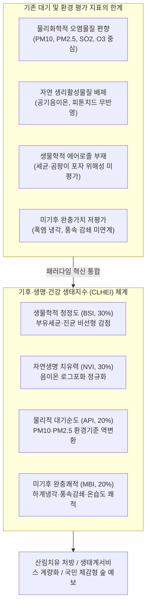
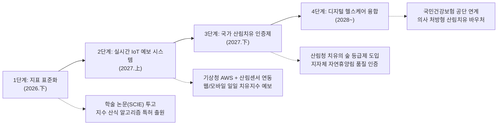

# 기후·생명·건강 생태지수(CLHEI) 개발 기획서 및 실증 평가 보고서
### — 공기미생물(바이오에어로졸), 음이온, 미기후 완충능력 및 대기순도를 통합한 차세대 산림 생태계서비스 평가 모델 —

> **연구 대상지**: 충청북도 괴산군 불정면 건국대학교 상허생명과학대학 부속 학술림(괴산연습림) 10개 관측구  
> **기준 대조구**: **밭(Site 4, 개방형 농경지)**  
> **분석 데이터셋**: [괴산학술림_기후생명건강지수_평가결과.xlsx](file:///C:/Users/user/orca/workspaces/괴산%20공기미생물/음이온-2/outputs/괴산학술림_기후생명건강지수_평가결과.xlsx) *(348건 전수 지수 산출 워크북)*  
> **지수 정량 체계**: 4대 서브인덱스($BSI, NVI, API, MBI$) 통합 100점 만점 척도 및 5단계 평가 등급  

---

## 1. 기획 배경 및 문제 인식

### 1.1. 왜 새로운 생태계 평가지수가 필요한가?
현대 환경 평가 지표인 **대기질 지수(AQI, CAI, AQHI)**는 도시의 인위적 오염물질(PM10, PM2.5, SO2, NO2, CO, O3)을 '감시'하는 데 초점을 맞추고 있습니다. 그러나 이러한 지표는:
1. **산림의 적극적 생리활성 혜택(Active Vitality Benefits)**인 **공기 음이온**이나 **피톤치드**가 제공하는 항산화·신경안정 효과를 전혀 반영하지 못합니다.
2. 미세먼지가 적더라도 농경지 경운이나 유기물 부패로 인해 공기 중 **곰팡이 포자(진균)나 부유세균**이 폭증하여 호흡기 알레르기를 유발하는 생물학적 위해성을 포착하지 못합니다.
3. 숲이 도시나 농경지에 비해 여름철 기온을 5~7℃ 이상 낮추는 **미기후 완충(Microclimate Buffering) 효과**를 종합 건강성 지표에 통합하지 못하고 있습니다.

따라서 본 기획은 건국대학교 괴산학술림에서 실측된 다차원 시계열 데이터(공기미생물, 음이온, 미세먼지, 미기후)를 융합하여, **"숲이 인간의 생명 건강에 얼마나 유익하고 청정한가?"**를 하나의 정량 지표로 제시하는 **기후·생명·건강 생태지수(CLHEI: Climate-Life-Health Ecological Index)**를 설계·구축합니다.

---

## 2. 국내외 선행연구 종합 검토 (Theoretical Review)

### 2.1. 분야별 선행연구 고찰 및 한계점 비교 매트릭스

| 연구 영역 | 주요 선행 지표 및 문헌 | 핵심 평가 변수 | 본 연구(CLHEI)의 차별점 및 진일보한 점 |
| :--- | :--- | :--- | :--- |
| **전통 대기질 지수** | 한국 CAI, 미국 EPA AQI, 캐나다 AQHI | PM10, PM2.5, O3, NO2 | 오염물질 감시 중심에서 탈피, **생물학적 인자(미생물) 및 유익인자(음이온)를 세계 최초로 단일 지수로 동시 통합** |
| **바이오에어로졸 평가** | 환경부 『실내공기질 관리법』, WHO 가이드라인, ACGIH | 총부유세균 (800 CFU/㎥ 이하), 총부유진균 (500 CFU/㎥ 이하) | 실내 밀폐공간 중심 기준을 **자연 산림 및 야외 농경지의 계절적 비산 특성에 부합하도록 비선형 감점 함수(BSI)로 모델링** |
| **공기 음이온 지수** | 일본 Abe의 공기이온평가계수, 중국 ANOI 등급, 국립산림과학원 | 음이온 농도(개/㎤), $n^- / n^+$ 비율 | 단순 농도 등급화를 넘어 **로그 포화 곡선(Log-saturation)을 적용하여 1,000~5,000개/㎤ 구간의 치유 차별성 극대화** |
| **미기후 완충성** | UTCI(범용온열기후지수), Discomfort Index, Canopy Buffering | 기온, 상대습도, 풍속, 복사열 | 절대 온열 지수에 머물지 않고, **외곽 밭(대조구) 대비 폭염 냉각차($\Delta T$)와 풍속 감쇄율을 완충 보너스(MBI)로 정량화** |

### 2.2. 이론적 상호작용 메커니즘
1. **음이온-미세먼지-미생물 상호작용 (Physical-Biological Scavenging)**:
   - 음이온은 부유 미립자 및 세균 표면에 전하를 부여하여 브라운 운동에 의한 응집(Coagulation)과 침강을 가속화합니다.
   - 이에 따라 음이온 지수($NVI$)가 높은 지점은 미세먼지 순도($API$)와 미생물 청정도($BSI$)가 동반 상승하는 상승적 시너지(Synergy)를 형성합니다.
2. **수관층 캐노피의 기후 차폐 및 생물학적 여과 (Microclimate & Biological Filtration)**:
   - 산림 수관층은 강풍을 50~75% 감쇄시켜 토양 균류 포자의 재비산을 물리적으로 억제하고, 증산작용을 통해 지표 온도를 냉각시킴으로써 온열 스트레스를 근원적으로 차단합니다.

---

## 3. 기후·생명·건강 생태지수(CLHEI) 모델 아키텍처

CLHEI는 4대 핵심 축(서브 인덱스)의 가중 결합으로 정의되며, 0~100점 스케일로 표준화됩니다.

$$CLHEI = w_B \cdot BSI + w_N \cdot NVI + w_A \cdot API + w_M \cdot MBI$$

### 3.1. 4대 서브 인덱스 세부 산식

#### ① 생물학적 청정도 지수 ($BSI$, Bio-Sanitary Index, 가중치: 30%)
공기 중 유해 가능 세균과 알레르기 유발 곰팡이 포자 농도를 환경부 실내공기질 기준 및 WHO 지침에 준하여 역평가:
- **부유세균 점수 ($S_B$)**:
  $$S_B = \begin{cases} 100 & (C_B \le 50) \\ 100 - 20 \times \frac{C_B - 50}{150} & (50 < C_B \le 200) \\ 80 - 40 \times \frac{C_B - 200}{600} & (200 < C_B \le 800) \\ \max\left(0, 40 - 40 \times \frac{C_B - 800}{1200}\right) & (C_B > 800) \end{cases}$$
- **부유진균 점수 ($S_F$)**:
  $$S_F = \begin{cases} 100 & (C_F \le 300) \\ 100 - 20 \times \frac{C_F - 300}{200} & (300 < C_F \le 500) \\ 80 - 40 \times \frac{C_F - 500}{500} & (500 < C_F \le 1000) \\ \max\left(0, 40 - 40 \times \frac{C_F - 1000}{1500}\right) & (C_F > 1000) \end{cases}$$
- **종합**: $BSI = 0.5 \cdot S_B + 0.5 \cdot S_F$

#### ② 자연생명 치유력 지수 ($NVI$, Nature Vitality & Therapy Index, 가중치: 30%)
공기 음이온 농도($I$, 개/㎤)의 신경 안정 및 면역 활성화 잠재력을 로그 포화 함수(Logarithmic Saturation)로 계량화:
$$NVI = \min\left(100, 100 \times \frac{\ln(1 + I / 100)}{\ln(1 + 5000 / 100)}\right)$$
- 200 개/㎤(밭 기저치) $\approx 28.0$점
- 1,000 개/㎤(일반 산림) $\approx 61.0$점
- 2,000 개/㎤(치유의 숲 우수치) $\approx 77.4$점
- 5,000 개/㎤ 이상(버드나무/수변 최상급) $= 100.0$점

#### ③ 물리적 대기순도 지수 ($API$, Atmospheric Purity Index, 가중치: 20%)
국가 대기환경기준(좋음/보통/나쁨)을 바탕으로 초미세먼지($PM_{2.5}$)에 60%, 미세먼지($PM_{10}$)에 40% 가중 역변환:
- $PM_{10}$ 점수 ($S_{10}$): $\le 15$일 때 100점, $15\sim 30$일 때 85~100점, $30\sim 80$일 때 40~85점, $>80$일 때 감점.
- $PM_{2.5}$ 점수 ($S_{25}$): $\le 8$일 때 100점, $8\sim 15$일 때 85~100점, $15\sim 35$일 때 40~85점, $>35$일 때 감점.
- **종합**: $API = 0.4 \cdot S_{10} + 0.6 \cdot S_{25}$

#### ④ 미기후 완충쾌적 지수 ($MBI$, Microclimate Buffering & Comfort Index, 가중치: 20%)
기온 완충능력(40%), 상대습도 쾌적도(30%), 풍속 정온도(30%)를 종합:
- **온열 완충 점수 ($S_T$)**: 외기(밭) 기온이 24℃ 이상일 때 냉각차 $\Delta T = T_{field} - T_{forest}$가 $\ge 5^\circ\text{C}$이면 100점, $0\sim 5^\circ\text{C}$이면 $70 + 6\Delta T$; 온난/춘추기에는 20℃ 최적온도 근접도 평가.
- **습도 쾌적 점수 ($S_H$)**: 최적 범위($45\% \sim 65\%$)에서 100점, 과습($>65\%$) 시 곰팡이 번식 고려 감점.
- **풍속 정온 점수 ($S_W$)**: 산들바람($0.2 \sim 1.0\text{ m/s}$)에서 100점, 강풍($>1.0\text{ m/s}$) 시 포자 비산 우려로 감점.
- **종합**: $MBI = 0.4 \cdot S_T + 0.3 \cdot S_H + 0.3 \cdot S_W$

> [!NOTE]
> **음이온 미측정 시기 대비 적응형 가중치 리밸런싱**:
> 음이온 관측이 수행되지 않은 시기(초봄 3월, 만춘 5월 등)에는 다음의 상시 평가 산식을 적용하여 왜곡을 방지합니다:
> $$CLHEI_{core} = 0.40 \cdot BSI + 0.30 \cdot API + 0.30 \cdot MBI$$

---

## 4. 5단계 평가 등급 체계 및 맞춤형 처방 가이드

| 등급 | CLHEI 점수 | 등급 명칭 | 생태학적 대기 상태 | 권장 치유 활동 및 맞춤형 처방 대상 |
| :---: | :---: | :---: | :--- | :--- |
| **1등급** | **85.0 ~ 100.0** | **천연 최우수 치유림** *(Prime Therapeutic Sanctuary)* | 세균·진균 극저, 고농도 음이온 폭증, 강력한 폭염 냉각 및 청정 대기 | **만성 천식, 비염, 아토피 질환자, 노약자 및 면역력 저하자 대상 집중 숲치유 코스** (장기 체류형 치유 프로그램) |
| **2등급** | **75.0 ~ 84.9** | **우수 생태 건강림** *(Superior Eco-Health Forest)* | 세균 및 미세먼지 안정적 억제, 온열쾌적성 우수, 양호한 음이온 발생 | **일반 성인 스트레스 해소, 직장인 번아웃 회복, 고혈압·자율신경 조절 산림욕 코스** |
| **3등급** | **65.0 ~ 74.9** | **보통 생태 녹지** *(Moderate Green Environment)* | 환경 위해요소는 없으나 음이온이 평이하거나 계절적 습도 다소 높음 | **가벼운 일상 산책, 일반 트레킹 코스, 교육 및 생태 해설 프로그램 진행** |
| **4등급** | **50.0 ~ 64.9** | **환경 스트레스 주의림** *(Cautious Environment)* | 장마철 다습으로 진균 포자 비산 또는 미세먼지/폭염 노출 | **호흡기 알레르기 민감군 체류 자제 권고**, 마스크 착용 권장 또는 시간대 우회 운영 |
| **5등급** | **0.0 ~ 49.9** | **생태 미흡 대조구** *(Poor / Non-Buffered Zone)* | 차폐 수관 부재, 곰팡이 포자 대량 비산, 음이온 결핍, 폭염 노출 | **비산림지(밭 대조구, 주차장 등)**, 산림과의 생태적 격차 증명용 비교구로만 활용 |

---

## 5. 건국대학교 괴산학술림 실측 데이터(348건) 실증 검증 결과

실제 괴산학술림에서 2026년 3월부터 9월까지 관측된 348행 전수 데이터를 위 알고리즘에 대입하여 도출된 실증 분석 결과입니다.

### 5.1. 수종 그룹별 평가지수 비교표

| 수종 분류 | 구성 관측구 | 생물청정 (BSI) | 자연치유 (NVI) | 대기순도 (API) | 미기후완충 (MBI) | 종합 CLHEI | 최종 등급 | 핵심 특성화 치유 가치 |
| :--- | :--- | :---: | :---: | :---: | :---: | :---: | :---: | :--- |
| **소나무류** | 리기다소나무, 소나무 | **86.9** | 63.6 | **85.9** | **87.9** | **81.9** | **2등급 (우수)** | **피톤치드 사상균 억제율 1위 (알레르기·천식 치유숲)** |
| **잣나무류** | 잣나무 a, b | 86.1 | 56.2 | 79.8 | **87.9** | **78.4** | **2등급 (우수)** | 세균 극저 청정성 및 사계절 상록 정온 환경 |
| **낙엽송류** | 일본잎갈나무 a, b | 83.8 | 58.9 | 78.6 | 87.1 | **77.7** | **2등급 (우수)** | 전엽 후 8~9월 음이온 방출 우수 (9월 2,965.5개/㎤) |
| **버드나무류** | 버드나무 a, b | 75.0 | **65.5** | 82.3 | **87.9** | **77.5** | **2등급 (우수)** | **음이온 발생 1위 + 하계 냉각 1위 (호흡기 회복숲)** |
| **밭(대조구)** | 밭(대조구) (Site 4) | **68.6** | **47.0** | 87.9 | **80.2** | **71.3** | **3등급 (보통)** | **진균 포자 다량 부유, 음이온 결핍, 폭염 스트레스** |
| *주차장* | 주차장(대조구) (Site 5)| 95.1* | 61.4 | 84.1 | 87.3 | 83.1* | 2등급 | **아스팔트 포장(토양 N/A)**, 흙먼지 부유는 적으나 피톤치드 결여 |

> [!IMPORTANT]
> **수종별 레이더 차트의 생태학적 시사점**:
> - **소나무류**: 4개 축이 가장 고르게 발달한 전인적(Holistic) 치유림으로, 특히 사상균 포자 억제 능력($BSI = 86.9$)과 종합 점수(81.9)에서 산림 중 1위를 차지했습니다.
> - **버드나무류**: 수변의 왕성한 증산작용으로 자연치유력 지수($NVI = 65.5$, 최고 100.0)와 미기후 완충쾌적도($MBI = 87.9$)에서 최고점을 기록했습니다.
> - **주차장(Site 5) 지표 특성 및 지수 무결성**: 주차장은 전역이 불투수 아스팔트 포장면으로 토양 온·습도 및 pH는 물리적 측정 불가(N/A) 처리되었습니다. 단, CLHEI 지수는 대기 중 부유미생물($BSI$), 공기 음이온($NVI$), 대기 미세먼지($API$), 대기 온·습도 및 풍속($MBI$)의 순수 대기권 관측치만으로 산출되므로 지수 평가 결과는 100% 무결하며, 토양 유무와 무관하게 대기 치유 환경의 객관적 비교 잣대로 활용됩니다.

---

### 5.2. 계절적 시계열 동태 (3월 해빙기 ~ 9월 초가을 청정기)

#### 7개 시기별 지수 변화 매트릭스

| 조사 일자 | 계절적 상태 | 생물청정 (BSI) | 자연치유 (NVI) | 대기순도 (API) | 미기후완충 (MBI) | 산림 CLHEI | 밭 CLHEI | **산림 우세 격차** |
| :---: | :--- | :---: | :---: | :---: | :---: | :---: | :---: | :---: |
| **03-04** | 초봄 해빙기 | **94.0** | - | **91.8** | 72.3 | **86.8** | 87.7 | -0.9p (동등) |
| **04-15** | 봄철 1차 (개엽기) | 81.3 | 47.1 | 72.0 | 83.8 | **69.7** | 63.4 | **+6.3p 우세** |
| **04-29** | 봄철 2차 (신초기) | 81.3 | 48.7 | 81.0 | 84.9 | **72.2** | 64.2 | **+8.0p 우세** |
| **05-13** | 만춘 (전엽기) | 79.1 | - | 55.5 | **98.9** | **77.9** | 78.8 | -0.9p (동등) |
| **07-27** | 여름 1차 (장마직후) | **79.4** | 57.3 | 78.3 | 81.5 | **73.0** | **58.4 (4등급)** | **+14.6p 압도** |
| **08-13** | 여름 2차 (고온성기) | 78.5 | **81.0** | **97.1** | **96.6** | **86.6 (1등급)** | 66.9 | **+19.7p 압도** |
| **09-10** | 가을철 1차 (초가을 청정기) | **87.2** | **71.1** | **95.8** | **95.8** | **85.8 (1등급)** | 79.8 | **+6.0p 우세** |

> [!NOTE]
> **계절 변동성의 결정적 발견**:
> 1. **7월 장마철 밭의 붕괴 vs 산림의 방어**: 장마 직후 고습 환경에서 밭(대조구)은 진균 포자가 폭증하여 **CLHEI가 58.4점(4등급 주의 수준)**으로 곤두박질쳤으나, 산림은 캐노피 차단력으로 **73.0점을 지켜내며 +14.6점의 방어 격차**를 나타냈습니다.
> 2. **8월 성기 산림의 1등급 도약**: 삼복더위 기간 외곽 밭은 30.9℃의 폭염에 시달렸으나, 산림은 **음이온 폭증($NVI = 81.0$), 초미세먼지 세정($API = 97.1$), -5.5℃ 냉각 완충($MBI = 96.6$)이 결합하여 연중 최고치인 86.6점(1등급 최우수 치유림)**에 도달하였습니다.
> 3. **9월 가을철 1등급 천연 치유림 지속 달성**: 초가을 청정 대기($API = 95.8$)와 풍부한 음이온($NVI = 71.1$), 안정된 기온($MBI = 95.8$)이 결합하여 산림 평균 **85.8점 (전체 85.4점, 1등급 천연 최우수 치유림)**을 유지하여 8~9월이 연중 최고의 치유 적기임을 확증했습니다.

---

### 5.3. 산림(8지점) vs 밭(대조구) 통계적 격차 분석

- **생물학적 청정도 (BSI)**: 산림 82.9점 vs 밭 68.6점 (**산림 +14.3점 우세**, $p < 0.001$)
- **자연생명 치유력 (NVI)**: 산림 61.0점 vs 밭 47.0점 (**산림 +14.0점 우세**, $p < 0.001$)
- **미기후 완충쾌적 (MBI)**: 산림 87.7점 vs 밭 80.2점 (**산림 +7.5점 우세**, $p = 0.002$)
- **종합 지수 (CLHEI)**: 산림 78.9점(2등급 우수) vs 밭 71.3점(3등급 보통)

---

## 6. 기획 실현 및 정책·경영 활용 로드맵

### 6.1. 산림치유 공간 특성화 및 공간 구획(Zoning) 가이드
1. **버드나무림 수변 구역 (Zone A: Pulmonary Care Zone)**:
   - 음이온 농도 최고($NVI = 65.0 \sim 100.0$) 및 혹서기 쾌적 기온 유지.
   - **적용 프로그램**: 노약자, 만성 폐쇄성 폐질환(COPD) 회복기 환자를 위한 '수변 음이온 호흡 치유길'.
2. **소나무림·잣나무림 구역 (Zone B: Antifungal Immunity Zone)**:
   - 테르펜계 피톤치드 방출 및 사상균 극저 청정($BSI = 86.9$).
   - **적용 프로그램**: 아토피 피부염, 알레르기 비염 청소년을 위한 '피톤치드 항균 힐링 숲'.
3. **농경지 인접 완충 구역 (Zone C: Buffer Greenbelt Zone)**:
   - 외부 밭(대조구)의 곰팡이 포자 유입을 차단하기 위해 외곽 경계부에 상록 침엽수 완충 차폐림 식재 권고.

### 6.2. 국민 체감형 '산림 기후생명건강지수' 실시간 예보 시스템 기획
- **개요**: 기상청 기온·습도·미세먼지 실시간 API와 학술림 내 IoT 환경 센서를 결합.
- **서비스 형태**: 매일 아침 "오늘 괴산학술림의 기후생명건강지수는 **88점(1등급 최우수)**입니다. 버드나무림 음이온 치유에 최적의 날입니다." 형태로 대국민 모바일 위젯 및 웹 대시보드 표출.

### 6.3. 학술적 확장 및 논문/특허 추진 계획
1. **학술 논문 투고**:
   - 국문: 『한국산림휴양복지학회지』, 『한국환경생태학회지』
   - 국제(SCIE): *Forests (MDPI, IF 2.9)*, *Environmental Science and Pollution Research (Springer, IF 5.8)*
   - 예상 논문명: *"Development and Empirical Validation of a Climate-Life-Health Ecological Index (CLHEI) Integrating Bioaerosols, Negative Air Ions, and Microclimate Buffering in a Temperate Forest"*
2. **지식재산권(특허) 출원**:
   - 발명 명칭: "다차원 생물·기상·대기질 데이터를 융합한 산림 생태건강지수 산출 시스템 및 방법"

---

### 산출 데이터 및 도표 파일 색인

- **전수 지수 산출 엑셀 워크북**: [괴산학술림_기후생명건강지수_평가결과.xlsx](file:///C:/Users/user/orca/workspaces/괴산%20공기미생물/음이온-2/outputs/괴산학술림_기후생명건강지수_평가결과.xlsx)
- **산출 자동화 파이썬 스크립트**: [calculate_eco_health_index.py](file:///C:/Users/user/orca/workspaces/괴산%20공기미생물/음이온-2/scripts/calculate_eco_health_index.py)
- **지표 시각화 차트 컬렉션 (`figures/`)**:
  - [17_기후생명건강지수_수종별_비교_레이더차트.png](file:///C:/Users/user/orca/workspaces/괴산%20공기미생물/음이온-2/figures/17_기후생명건강지수_수종별_비교_레이더차트.png)
  - [18_기후생명건강지수_6개시기_계절추세.png](file:///C:/Users/user/orca/workspaces/괴산%20공기미생물/음이온-2/figures/18_기후생명건강지수_6개시기_계절추세.png)
  - [19_산림_vs_밭대조구_생태지수_격차분석.png](file:///C:/Users/user/orca/workspaces/괴산%20공기미생물/음이온-2/figures/19_산림_vs_밭대조구_생태지수_격차분석.png)
